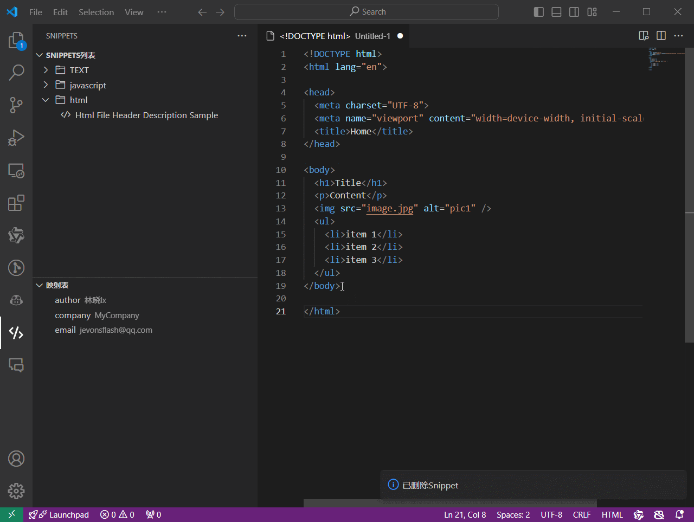
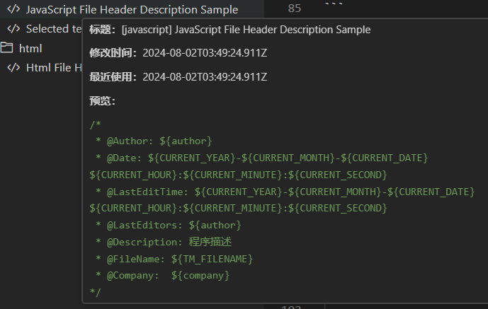
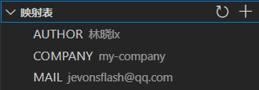
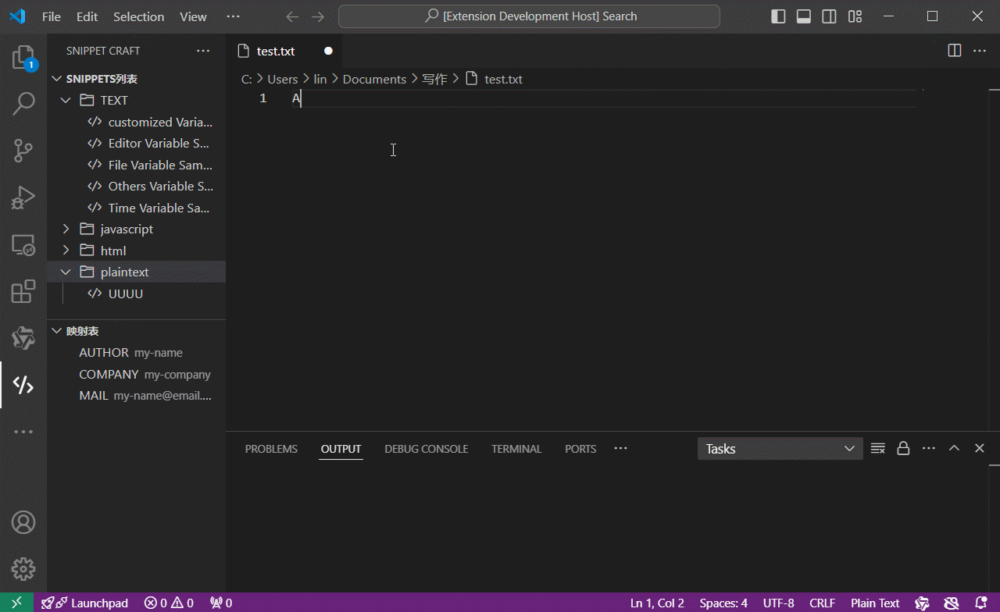

# Snippet Craft

一个VS Code代码片段管理插件

## 功能

### 创建和插入代码片段


在编辑器区域右键菜单中点击插入Snippet，或在代码片段视图中点击条目，则会将代码片段插入到当前激活文档的光标位置。



###  代码片段编辑

代码片段在左侧栏中，根据创建时的文件内容类型，分组显示代码片段，可编辑已有的代码片段。


### 代码片段预览


鼠标移动到代码片段条目上时，显示tooltip预览




### 默认映射

映射是插入代码片段时，自动替换的变量。

代码片段中通过设置占位符`${VAR_NAME}`，在插入代码片段时，将自动替换为全局变量中的值。可用的映射如下表：

|**类别**|**变量**|**描述**|
|---|---|---|
|**文件和编辑器相关**|TM\_SELECTED\_TEXT|当前选定的文本或空字符串|
||TM\_CURRENT\_LINE|当前行的内容|
||TM\_CURRENT\_WORD|光标下的单词或空字符串的内容|
||TM\_LINE\_INDEX|基于零索引的行号|
||TM\_LINE\_NUMBER|基于一个索引的行号|
||TM\_FILENAME|当前文档的文件名|
||TM\_FILENAME\_BASE|当前文档的文件名（不含扩展名）|
||TM\_DIRECTORY|当前文档的目录|
||TM\_FILEPATH|当前文档的完整文件路径|
||RELATIVE\_FILEPATH|当前文档的相对文件路径（相对于打开的工作区或文件夹）|
||CLIPBOARD|剪贴板的内容|
||WORKSPACE\_NAME|打开的工作区或文件夹的名称|
||WORKSPACE\_FOLDER|打开的工作区或文件夹的路径|
||CURSOR\_INDEX|基于零索引的游标编号|
||CURSOR\_NUMBER|基于单索引的游标编号|
|**时间相关**|CURRENT\_YEAR|本年度|
||CURRENT\_YEAR\_SHORT|当年的最后两位数字|
||CURRENT\_MONTH|两位数字的月份（例如“02”）|
||CURRENT\_MONTH\_NAME|月份的全名（例如“July”）|
||CURRENT\_MONTH\_NAME\_SHORT|月份的简短名称（例如“Jul”）|
||CURRENT\_DATE|以两位数字表示的月份中的某一天（例如“08”）|
||CURRENT\_DAY\_NAME|日期的名称（例如“星期一”）|
||CURRENT\_DAY\_NAME\_SHORT|当天的简短名称（例如“Mon”）|
||CURRENT\_HOUR24|小时制格式的当前小时|
||CURRENT\_MINUTE|两位数的当前分钟数|
||CURRENT\_SECOND|当前秒数为两位数|
||CURRENT\_SECONDS\_UNIX|自 Unix 纪元以来的秒数|
||CURRENT\_TIMEZONE\_OFFSET|当前 UTC 时区偏移量为 +HH <br> 或者 -HH <br> (例如“-07:00”)|
|**其他**|RANDOM6|6 个随机 Base-10 数字|
||RANDOM\_HEX6|6 个随机 Base-16 数字|
||UUID|第四版UUID|


注意：当自定义映射值未设置或者不可用时，将直接显示变量占位符


### 自定义映射


扩展初始化时，插入了三个常用的自定义映射，你可以自由更改或添加自定义映射。




示例：

代码片段内容
```
value of 'AUTHOR' is: ${AUTHOR}
value of 'COMPANY' is: ${COMPANY}
value of 'MAIL' is: ${MAIL}
value of 'FOOBAR' (non-exist) is: ${FOOBAR}
```
插入代码片段后，显示如下：
```
value of 'AUTHOR' is: 林晓lx
value of 'COMPANY' is: my-company
value of 'MAIL' is: jevonsflash@qq.com
value of 'FOOBAR' (non-exist) is: ${FOOBAR}
```


与自定义映射一样，当默认映射值未设置或者不可用时，将直接显示变量占位符


### 自动完成

代码片段可在编辑器中显示自动提示和补全内容。



## 快速开始

通过点击上方横幅上的安装按钮安装 Snippet Craft，或在 VS Code 的扩展侧边栏中搜索 Snippet Craft 进行安装。

## 更新内容

|  Date  |  Version   | Content                                                                                         |
| :----: | :--------: | :---------------------------------------------------------------------------------------------- |
| V0.1.0 | 2024-8-22  | 初始版本                                                        

## Todo

* [ ] 支持更多语言
* [ ] 使用monaco-editor
* [ ] 导入导出功能

## 作者信息

作者：林小

邮箱：jevonsflash@qq.com


## License

The MIT License (MIT)
